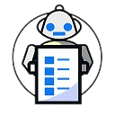

<!-- Improved compatibility of back to top link: See: https://github.com/othneildrew/Best-README-Template/pull/73 -->
<a name="readme-top"></a>

[![Contributors][contributors-shield]][contributors-url]
[![Forks][forks-shield]][forks-url]
[![Stargazers][stars-shield]][stars-url]
[![Issues][issues-shield]][issues-url]
[![MIT License][license-shield]][license-url]


<!-- PROJECT LOGO -->
<br />
<div align="center">
  <a href="https://github.com/loredous/discord-join-quiz-bot">
    
  </a>

<h3 align="center">Discord Join Quiz Bot</h3>

  <p align="center">
    A simple bot to ensure users have read your server rules <br>
    <a href="https://github.com/loredous/discord-join-quiz-bot/issues">Report Bug</a>
    ·
    <a href="https://github.com/loredous/discord-join-quiz-bot/issues">Request Feature</a>
  </p>
</div>


<!-- TABLE OF CONTENTS -->
<details>
  <summary>Table of Contents</summary>
  <ol>
    <li>
      <a href="#about-the-project">About The Project</a>
      <ul>
        <li><a href="#built-with">Built With</a></li>
      </ul>
    </li>
    <li>
      <a href="#getting-started">Getting Started</a>
      <ul>
        <li><a href="#prerequisites">Prerequisites</a></li>
        <li><a href="#installation">Installation</a></li>
      </ul>
    </li>
    <li><a href="#usage">Usage</a></li>
    <li><a href="#roadmap">Roadmap</a></li>
    <li><a href="#contributing">Contributing</a></li>
    <li><a href="#license">License</a></li>
    <li><a href="#contact">Contact</a></li>
    <li><a href="#acknowledgments">Acknowledgments</a></li>
  </ol>
</details>


<!-- ABOUT THE PROJECT -->
## About The Project

Running a large, publically posted Discord server with an oft misunderstood topic (Infosec/Ethical Hacking), we found that many new users were joining, immediately bypassing the rules screen without reading, and then proceeding to immediately violate the rules. Our solution to this problem was to build a bot that would intercept any new joiners, and ask them a few simple questions that hit on the biggest problems we see from users ignoring our rules. 

<p align="right">(<a href="#readme-top">back to top</a>)</p>


### Built With
[![Python][Python]][Py-url]

<p align="right">(<a href="#readme-top">back to top</a>)</p>


<!-- GETTING STARTED -->
## Getting Started

The simplest way to get started running the bot is to run it locally on your development system.To do this you will need:

- A supported version of Python installed
- A Discord bot token ([Instructions here](https://www.writebots.com/discord-bot-token/))
- A Discord server to test in

1. Clone the repository  (`git@github.com:loredous/discord-join-quiz-bot.git`)
2. Change into the newly cloned repository (`cd discord-join-quiz-bot`)
3. Install the required packages used by the bot (`pip install -r requirements.txt`)
4. Modify the `example_quiz.yaml` file to include the appropriate ID values for your test server
5. Set the Discord bot token in the environment variable BOT_TOKEN (`export BOT_TOKEN=mytokengoeshere`)
6. Run the bot (`python code/bot.py`)

### Prerequisites

* pip
  ```sh
  pip install --update pip
  OR
  apt-get install python3-pip
  OR
  yum install python-pip
  ```

### Installation

The preferred way to run the bot is by deploying the latest version of the Docker container image with your specific quiz configuration mapped to `/conf/quiz.yaml`, and the Discord bot token provided in the environment variable BOT_TOKEN.

`docker run -d -e BOT_TOKEN=mytokengoeshere -v ./my_quiz.yaml:/conf/quiz.yaml docker pull ghcr.io/loredous/discord-join-quiz-bot:main`

<p align="right">(<a href="#readme-top">back to top</a>)</p>


<!-- USAGE EXAMPLES -->
## Usage

!!! COMING SOON !!!

<p align="right">(<a href="#readme-top">back to top</a>)</p>


<!-- ROADMAP -->
## Roadmap

!!! COMING SOON !!!

See the [open issues](https://github.com/loredous/discord-join-quiz-bot/issues) for a full list of proposed features (and known issues).

<p align="right">(<a href="#readme-top">back to top</a>)</p>


<!-- CONTRIBUTING -->
## Contributing

Contributions are what make the open source community such an amazing place to learn, inspire, and create. Any contributions you make are **greatly appreciated**.

If you have a suggestion that would make this better, please fork the repo and create a pull request. You can also simply open an issue with the tag "enhancement".
Don't forget to give the project a star! Thanks again!

1. Fork the Project
2. Create your Feature Branch (`git checkout -b feature/AmazingFeature`)
3. Commit your Changes (`git commit -m 'Add some AmazingFeature'`)
4. Push to the Branch (`git push origin feature/AmazingFeature`)
5. Open a Pull Request

<p align="right">(<a href="#readme-top">back to top</a>)</p>


<!-- LICENSE -->
## License

Distributed under the GPL-3.0 license. See `LICENSE.txt` for more information.

<p align="right">(<a href="#readme-top">back to top</a>)</p>


<!-- CONTACT -->
## Contact

Jeremy Banker - Loredous#7762

Project Link: [https://github.com/loredous/discord-join-quiz-bot](https://github.com/loredous/discord-join-quiz-bot)

<p align="right">(<a href="#readme-top">back to top</a>)</p>


<!-- ACKNOWLEDGMENTS -->
## Acknowledgments

* [Hacking and Coding Discord Server](https://discord.gg/hackncode)

<p align="right">(<a href="#readme-top">back to top</a>)</p>


<!-- MARKDOWN LINKS & IMAGES -->
<!-- https://www.markdownguide.org/basic-syntax/#reference-style-links -->
[contributors-shield]: https://img.shields.io/github/contributors/loredous/discord-join-quiz-bot.svg?style=for-the-badge
[contributors-url]: https://github.com/loredous/discord-join-quiz-bot/graphs/contributors
[forks-shield]: https://img.shields.io/github/forks/loredous/discord-join-quiz-bot.svg?style=for-the-badge
[forks-url]: https://github.com/loredous/discord-join-quiz-bot/network/members
[stars-shield]: https://img.shields.io/github/stars/loredous/discord-join-quiz-bot.svg?style=for-the-badge
[stars-url]: https://github.com/loredous/discord-join-quiz-bot/stargazers
[issues-shield]: https://img.shields.io/github/issues/loredous/discord-join-quiz-bot.svg?style=for-the-badge
[issues-url]: https://github.com/loredous/discord-join-quiz-bot/issues
[license-shield]: https://img.shields.io/github/license/loredous/discord-join-quiz-bot.svg?style=for-the-badge
[license-url]: https://github.com/loredous/discord-join-quiz-bot/blob/master/LICENSE
[Python]: https://img.shields.io/badge/Python-3776AB?style=for-the-badge&logo=python&logoColor=white
[Py-url]: https://www.python.org/
